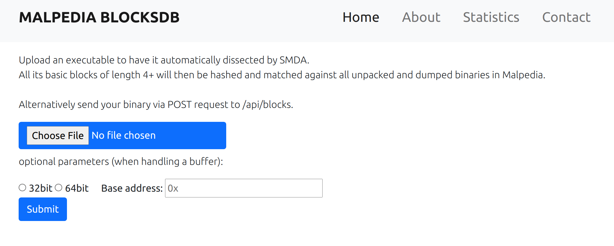
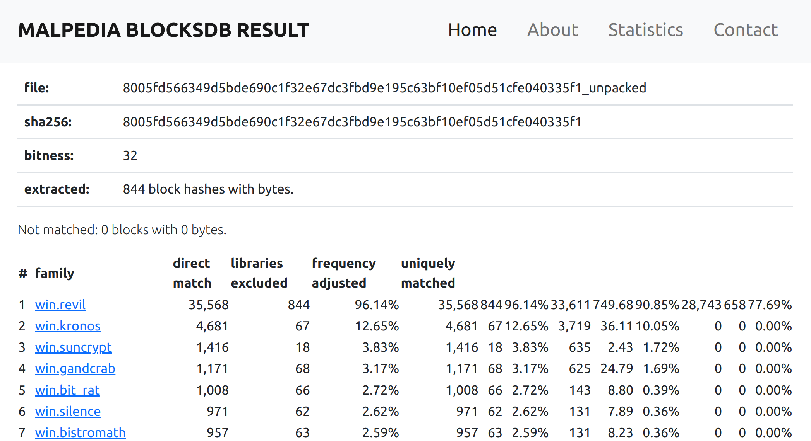
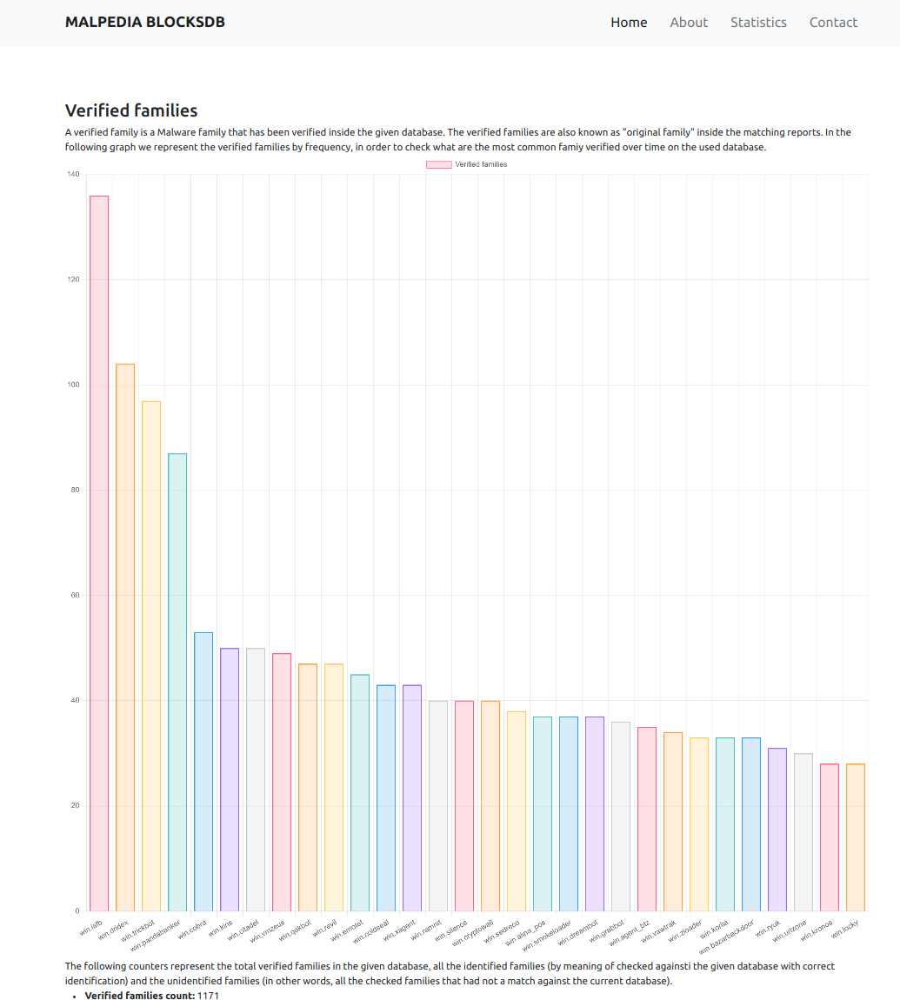

# PicBlocks

An experimental project using position-independent code hashing over basic blocks for code similarity estimation.

## Usage

Both module files in `./picblocks` and in `./utils` are runnable and contain examples of their usage:

* `$ python -m picblocks.blockhasher <target_binary_path>` - produces a `block-report` for a single binary.
* `$ python -m picblocks.blockhashmatcher <block_reports_path>` - creates a new `./db/picblocksdb.json` from the `block-reports` located in `<block_reports_path>`
* `$ python -m blocks.blockhashmatcher <block_reports_path> <target_binary_path>` - matches a binary against data stored in `./db/picblocksdb.json` if it exists, or otherwise creates `./db/picblocksdb.json` from the `block-reports` located in `<block_reports_path>`
* `$ python -m utils.import_picblocksdb_to_mongo.py` assumes some mongodb configurations (please check inside the file to adapt to yours) it merely takes the json generated DB into a most easy to manage (and query)  mongodb. 
* `$ python -m utils.make_stats.py` it assumes a mongodb connection (please check inside the file to adapt to yours), the generated json db into `db/picblocksdb.json` (you can change it directly in the relative varible) and the generated blocks report into `./block-reports/` folder. It builds up some statistics about detections and DB composition. The results would be available in a dedicated (and very simple) stats web ui. 

## Creating a Database

The script `hash_malpedia.py` is an example of how to process a collection of binaries into `./block-reports`, which will then be aggreated into a `./db/picblocksdb.json`.

## Database Evaulation

In oder to quantify and to measure the quality of your detection rate you should check some basic informations about tests run against your db. 
The simple (and preliminary) script named `make_stats.py` would build up some initial stats for you about detection rates. 
It assumes to have a mongodb connection, the generated json db into `db/picblocksdb.json` (you can change it directly in the relative varible) and the generated blocks reports into `./block-reports/` folder (you can change it directly on the specified variable). 
Once you run it, it takes every single block report and check it against the json database.
It build some stats and saves all the matching results into db. 
A dedicated web page (and a relative API) is built to show the detection rates and some more interesting statistics on your database.

## Running as a Service

If a `./db/picblocksdb.json` exists, you can run

`$ python app.py` 

to spawn a local demo server (`https://127.0.0.1:9001`) to query against.

### Screenshots

Just few screenshots about the initial stage of web user interface 
The submit form. Once you have a given database (`./db/picblocksdb.json`) you can check matching from samples by submitting your samples from 
this form.

  

If the submitted sample gets some matches against the given database you should see a block similarity matrix (still under development for a better visualization)

  

Finally the matching database statistics generated by the script into `utils/make_stats.py` which takes all the generated block_reports (`block-reports/`) and check them against the generated databases (`./db/picblocksdb.json`) in order to estimate the detection rate on a given database.

  

## Contributors

* [Daniel Plohmann](https://github.com/danielplohmann)
* [Marco Ramilli](https://github.com/marcoramilli)
* [Daniele Bellavista](https://github.com/dbellavista)

## Version History

* 2021-10-01: v1.1.1 - added script to check detection rates and relative web interface page
* 2021-09-28: v1.1.0 - added simple web user interface and a db connection
* 2021-09-12: v1.0.6 - added submission form fields for bitness and base address to force overrides for those values.
* 2021-08-24: v1.0.5 - improved parsing of bitness from submission filenames.
* 2021-08-20: v1.0.4 - Tweaked result visualization, now showing all unique matches beyond the first 20.
